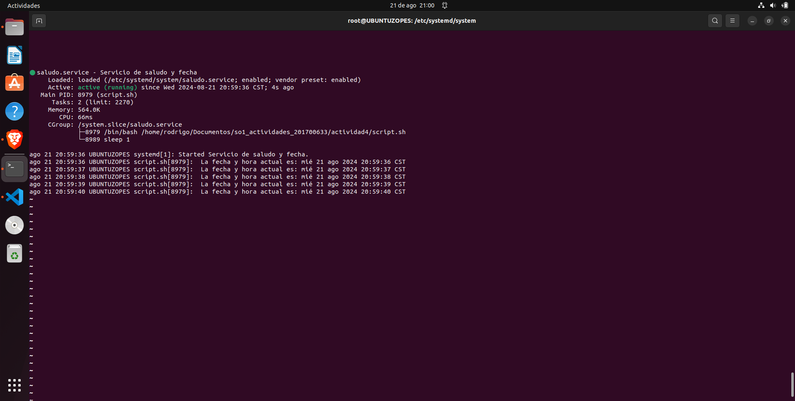

# ACTIVIDAD 4
 
 Ejecutar un script imprima un saludo y la fecha actual infinitamente con una pausa de un segundo. 

 para eso creamos un script que haga un saludo y la fecha actual infinitamente 

 
# [LINK A  -> SCRIPT DEL SALUDO ](script.sh)

luego creamos un archivo de unidad de systemd para tu servicio. Creamos un archivo llamado saludo.service en el directorio /etc/systemd/system/

# [LINK A  -> SALUDO.SERVICE ](saludo.service)

Después de crear el archivo de unidad, recarga el sistema systemd para reconocer el nuevo servicio y habilítalo para que se inicie automáticamente al arrancar el sistema


```
sudo systemctl daemon-reload
sudo systemctl enable saludo.service
sudo systemctl start saludo.service

```

luego verificamos el servico con el comando 
```
sudo systemctl status greeting.service
```

# Screen de la habilitacion del saludo.service



para parar el servicio inmediatamente usamos

```
sudo systemctl stop saludo.service


```
para deshabilitar el servicio usamos el siguiente comando :

```
sudo systemctl disable saludo.service

```